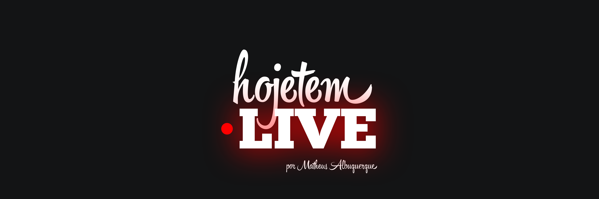

<h1 align="center">
	
	<br>
	<br>
</h1>

<br>
<br>

<p align="center">
	🎶Curated live concerts from famous Brazilian artists.
</p>

<br>

## Getting Started

Clone the repository.

```sh
git clone git@github.com:ythecombinator/hoje-tem-live.git
```

`cd` into the directory.

```sh
cd hoje-tem-live
```

Install the project dependencies:

```sh
yarn

# or

npm install
```

Create a `.env` file in the project root containing the API endpoint:

```sh
API_BASE=""
```

Start the development server:

```sh
yarn dev

# or

npm run dev
```

🚀 Head over [localhost:3000](http://localhost:3000) in your browser of choice.

## Toolbelt

- [x] [Next.js](https://github.com/zeit/next.js)
- [x] [Typescript](https://github.com/microsoft/TypeScript)
- [x] [Material UI](https://github.com/mui-org/material-ui)
- [x] [now](https://github.com/zeit/now)

## Structure

> Further documentation on project structure will come as we have it more concise.

## Credits

- Most of the UI design was heavily inspired by [Hero35](https://hero35.com/).
